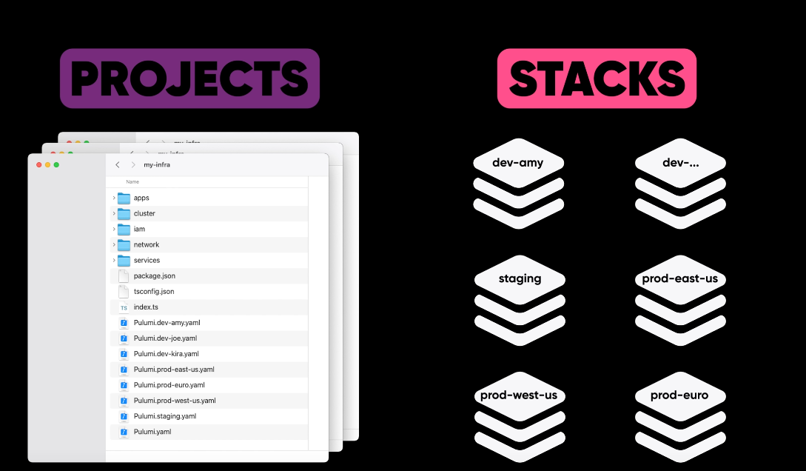
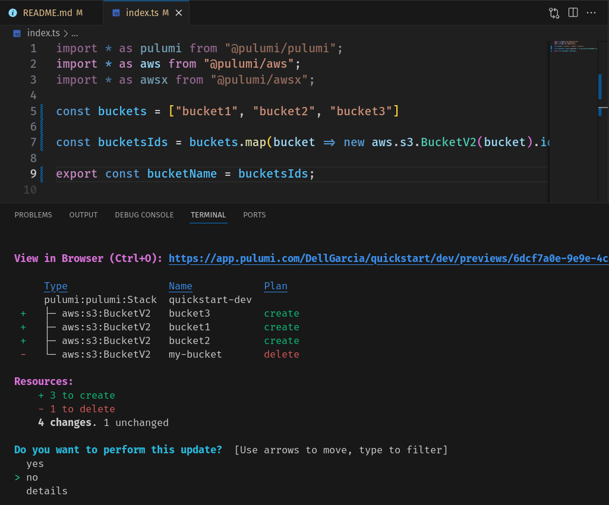
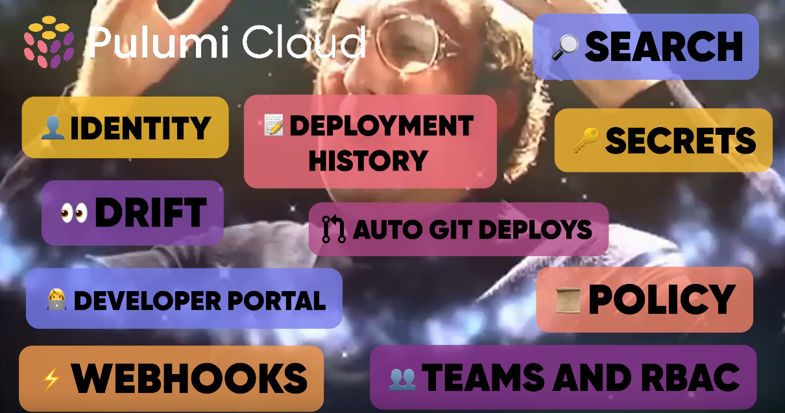

# 
Estudo sobre o Pulumi

Este repositório tem como objetivo documentar meus estudos sobre a ferramenta Pulumi, o código aqui foi criado seguindo os passos na documentação do Pulumi para integra-lo com a AWS.

Confira o passo a passo em: [Get Started with Pulumi & AWS](https://www.pulumi.com/docs/iac/get-started/aws/)

## Conhecendo o Pulumi

Pulumi é uma ferramenta que permite criar uma infraestrutura como código (Infrastructure as Code) para diversas plataformas de cloud, como AWS, GCP, Azure e muitas outras.

Ter uma infraestrutura como código permite utilizar as vantagens de uma linguagem de programação, como estruturas condicionais e de repetição, arrays, listas, funções e testes, além de permitir que o desenvolvedor utilize sua experiência e ferramentas com sua linguagem de preferência.

O Pulumi oferece suporte a muitas das linguagens populares como:

* Typescript 
* Java
* CSharp
* Go
* Python

## Como funciona o Pulumi (Project and Stack)

Um projeto Pulumi trabalha com um conceito de Stacks, uma Stack é uma instancia do projeto, permitindo criar diversos ambientes com configurações diferentes e mante-los sincronizados.

### Estados e Planos (Plan and States)

O Pulumi funciona de forma declarativa ele avalia o que existe no script e compara com o estado atual (State), com isso ele formula um plano (Plan) e apresenta ao desenvolvedor que pode avaliar se as alterações estão corretas ou se precisam de algum ajuste.
Isso é bem interessante, pois deixa claro o que vai mudar e evita alterações indesejadas.

### Pulumi Cloud

Pulumi Cloud funciona como um repositório remoto de forma semelhante ao Github, onde diferentes pessoas podem contribuir em um mesmo projeto onde tudo fica registrado e pode ser melhor gerenciado.

